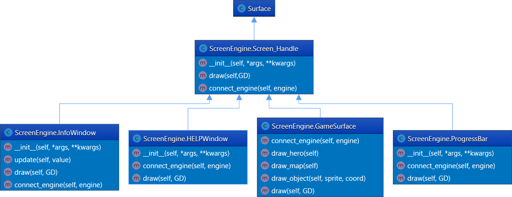

# Игра «Рыцарь в подземелье»
Реализуйте все классы в соответствии с UML диаграммами, и исправьте все #FIXME.
### Objects

### Engine

### Service

## Дополнительные задачи:
+ Реализованы собственный противник и союзник;
+ Добавлена отрисовка миникарты;
+ Реализован дополнительный эффект.

## Особенности реализации
**Программа не доделана в целях экономии времени для выполнения pet-проекта**