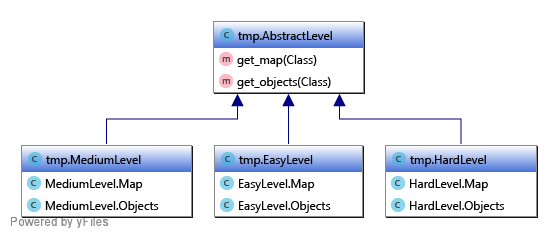

# Реализация паттерна Абстрактная фабрика
Даны шесть классов: EasyMap, EasyObjects, MediumMap, MediumObjects, HardMap, HardObjects. Каждый из классов генерирует карту и список объектов для неё.

На их основе необходимо создать абстрактную фабрику AbstractLevel c классовыми методами get_map() и get_objects(). Её реализации должны носить имена EasyLevel, MediumLevel и HardLevel.

## Особенности реализации
Коды фабрик содержатся в следующих файлах:
* [Абстрактная фабрика](abstract_factory.py)
* [Легкая фабрика](easy_factory.py)
* [Средняя фабрика](medium_factory.py)
* [Тяжелая фабрика](hard_factory.py)